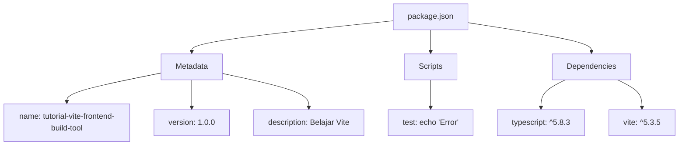

# Package.json Structure


```mermaid
flowchart TD
    A[package.json] --> B[Metadata]
    A --> C[Scripts]
    A --> D[Dependencies]
    
    B --> B1[name: tutorial-vite-frontend-build-tool]
    B --> B2[version: 1.0.0]
    B --> B3[description: Belajar Vite]
    
    C --> C1[test: echo 'Error']
    
    D --> D1[typescript: ^5.8.3]
    D --> D2[vite: ^5.3.5]

    
```

## Cara Penggunaan

### Development
```bash
npm install
npm run dev
```

### Production Build
```bash
npm run build
```

### Testing
```bash
npm test
```