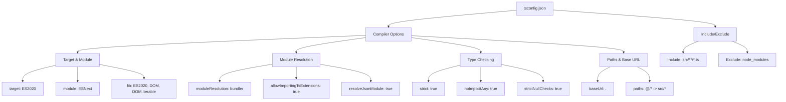

# tsconfig.json Structure

## Keterangan Diagram

### Compiler Options
- **Target & Module**: Konfigurasi versi JavaScript dan sistem modul
- **Module Resolution**: Pengaturan cara TypeScript menyelesaikan modul
- **Type Checking**: Pengaturan strict type checking
- **Paths & Base URL**: Konfigurasi path aliases

### Include/Exclude
- File-file yang termasuk dan dikecualikan dari kompilasi

## Cara Membaca
- Setiap kotak mewakili bagian dari konfigurasi
- Panah menunjukkan hubungan parent-child
- Warna berbeda untuk membedakan kategori utama